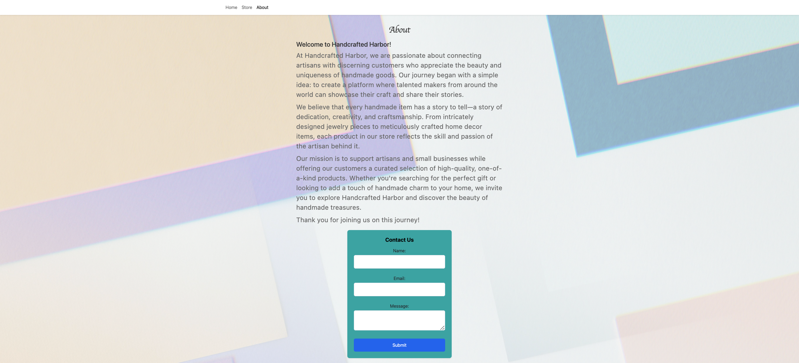
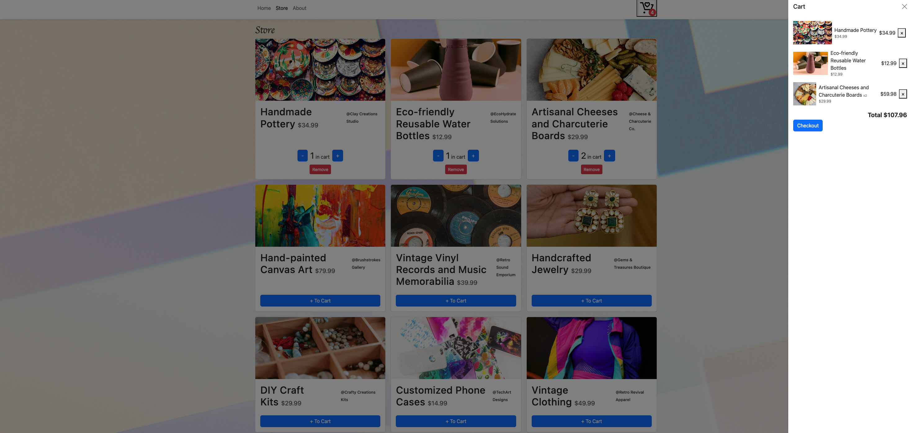
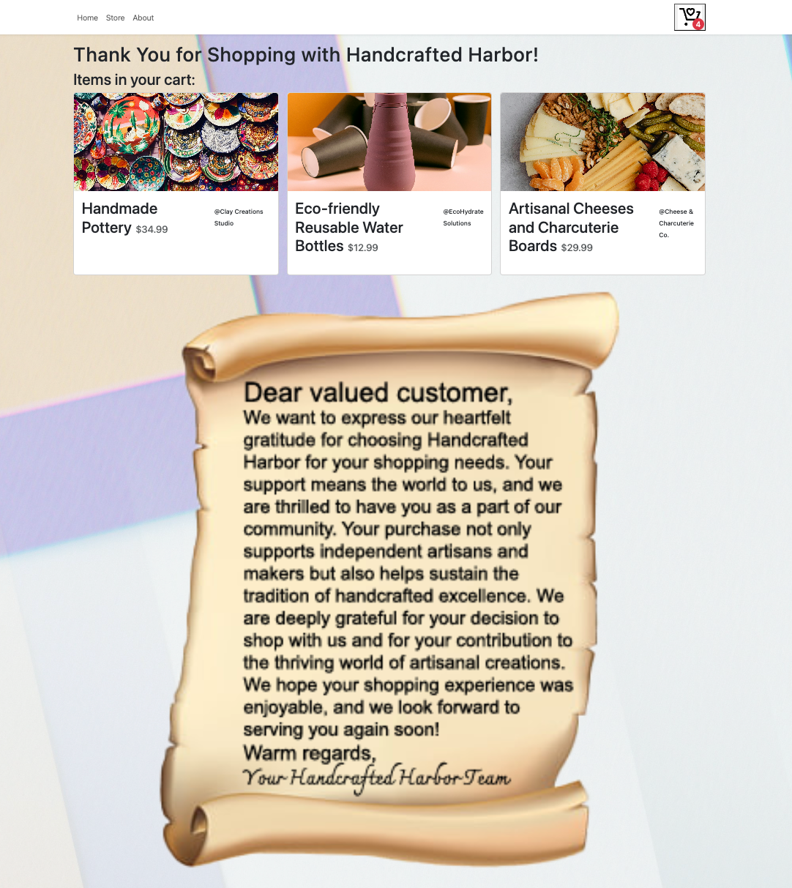

# Handcrafted Harbor
# React + TypeScript + Vite App

Our store, Handcrafted Harbor, offers a curated collection of handcrafted treasures ranging from unique jewelry pieces and vintage clothing to eco-friendly home decor items, providing customers with an eclectic mix of artisanal products that celebrate creativity and craftsmanship.

## Final Product
## Home

## Store

## About

## Cart

## Check out

## Dependencies
    - bootstrap: 5.3.3
    - react: 18.2.0
    - react-bootstrap: 2.10.2
    - react-dom: 18.2.0
    - react-router-dom: 6.22.3
    - tailwind: 4.0.0

## Starting the Server

- Install dependencies: npm install
 - Run `npm run dev` in Terminal
 - Visit: http://localhost:5173
